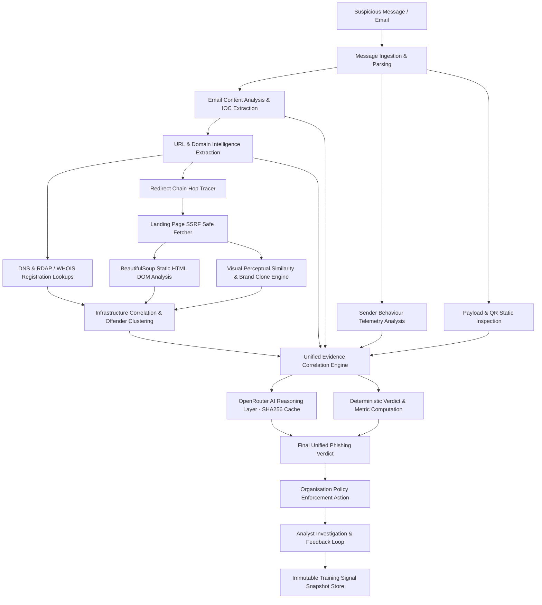
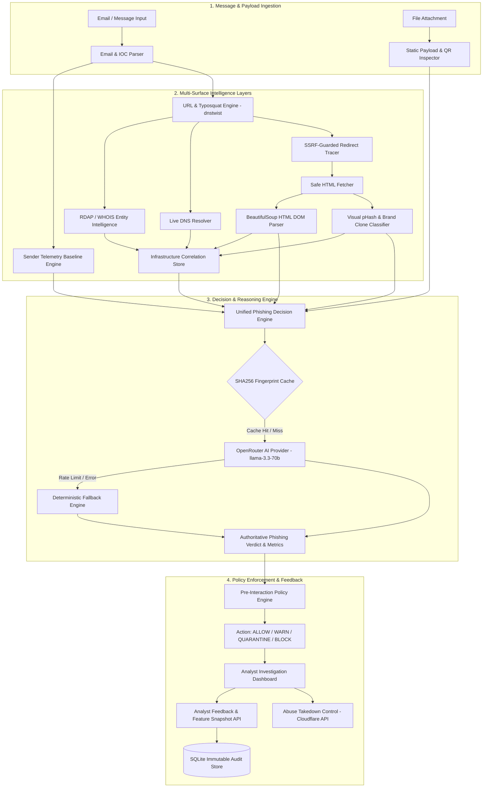

# KEKAI — Complete Feature & Technical Capability Reference

## 1. Product Overview

**KEKAI (The AI Phishing Slayer)** is an enterprise-grade, multi-stage phishing detection and evidence correlation platform designed for organizations. It solves the critical challenge of detecting sophisticated phishing emails, lookalike websites, malicious payloads, and credential harvesting campaigns before users interact with them.

### Problem Statement & Target User
- **Problem Statement**: PS #2 — *AI Phishing Detection for Organisations*.
- **Target User**: Security Operations Center (SOC) analysts, enterprise IT security teams, and incident response personnel.
- **Organisational Use Case**: Automated ingestion, multi-surface evidence extraction, threat graph correlation, pre-interaction policy enforcement, and explainable AI-backed phishing verdicts.

### Core Security Thesis
> **KEKAI investigates a suspicious message across multiple independent evidence layers rather than judging the message from content alone.**

A single email text snippet or URL is rarely sufficient to identify modern corporate phishing. KEKAI correlates signals across **12 independent analysis layers**: email headers/body, sender organizational behavior, static payload/QR attachments, URL structure, domain registration/RDAP, DNS records, redirect hops, static HTML DOM architecture (BeautifulSoup), visual perceptual similarity (pHash/Phishpedia), infrastructure clustering, global threat feeds (OpenPhish/PhishTank), and organizational feedback.

---

## 2. PS #2 Requirement Mapping

| PS Requirement | KEKAI Capability | Status | Codebase Evidence |
|---|---|---|---|
| **Content Analysis** | Multi-signal NLP, urgency language, credential harvesting keyword detection, financial request triggers, intent classification. | **IMPLEMENTED** | [`services/email_analysis.py`](file:///d:/MUJ%20HACKATHON/IKIGAI/services/email_analysis.py), [`services/intent_classifier_service.py`](file:///d:/MUJ%20HACKATHON/IKIGAI/services/intent_classifier_service.py) |
| **URL & Domain Analysis** | Lookalike domain discovery, typosquatting permutations, homoglyphs, newly registered domain age classification (RDAP), DNS intelligence, redirect chain tracking, credential page detection. | **IMPLEMENTED** | [`services/url_intelligence.py`](file:///d:/MUJ%20HACKATHON/IKIGAI/services/url_intelligence.py), [`services/dnstwist_service.py`](file:///d:/MUJ%20HACKATHON/IKIGAI/services/dnstwist_service.py), [`services/redirect_tracer.py`](file:///d:/MUJ%20HACKATHON/IKIGAI/services/redirect_tracer.py), [`services/dns_intelligence_service.py`](file:///d:/MUJ%20HACKATHON/IKIGAI/services/dns_intelligence_service.py) |
| **Page Similarity Detection** | Static HTML DOM parsing via BeautifulSoup, brand template repository matching, visual perceptual hash comparison (pHash/dHash), structural DOM fingerprinting, multi-signal brand clone classification. | **IMPLEMENTED** | [`services/page_analyzer.py`](file:///d:/MUJ%20HACKATHON/IKIGAI/services/page_analyzer.py), [`services/imagehash_service.py`](file:///d:/MUJ%20HACKATHON/IKIGAI/services/imagehash_service.py), [`services/phishpedia_service.py`](file:///d:/MUJ%20HACKATHON/IKIGAI/services/phishpedia_service.py) |
| **Sender Behaviour Modelling** | Organisational baseline comparison, off-hours anomaly detection, destination domain anomaly, link behavior anomaly, language intent anomaly, attachment anomaly, recipient pattern anomaly, account compromise hypothesis. | **IMPLEMENTED** *(Simulated Baseline)* | [`services/sender_behavior.py`](file:///d:/MUJ%20HACKATHON/IKIGAI/services/sender_behavior.py), [`config/organisational_baselines.json`](file:///d:/MUJ%20HACKATHON/IKIGAI/config/organisational_baselines.json) |
| **Explainable Verdicts** | Provenance-backed evidence cards, attack hypotheses, independent risk score, confidence score, evidence quality score, AI reasoning with 1-pass fingerprint cache. | **IMPLEMENTED** | [`services/phishing_decision_engine.py`](file:///d:/MUJ%20HACKATHON/IKIGAI/services/phishing_decision_engine.py), [`services/ai_reasoning.py`](file:///d:/MUJ%20HACKATHON/IKIGAI/services/ai_reasoning.py) |
| **Feedback Loop** | Analyst decision recording (`ANALYST_CONFIRMED_PHISHING`, `ANALYST_FALSE_POSITIVE`), immutable SQLite audit store, feature vector snapshots, training signal API, adaptive signal adjustments. | **IMPLEMENTED** | [`services/feedback_service.py`](file:///d:/MUJ%20HACKATHON/IKIGAI/services/feedback_service.py), [`database.py`](file:///d:/MUJ%20HACKATHON/IKIGAI/database.py) |
| **Bonus Creativity (Payload & QR)** | Safe static attachment inspection (PDF text extraction, ZIP metadata, HTML embedded forms, password input detection, SHA-256 hashing) and QR code decoding (`pyzbar`/`cv2`). | **IMPLEMENTED** | [`services/payload_inspection.py`](file:///d:/MUJ%20HACKATHON/IKIGAI/services/payload_inspection.py) |
| **Pre-Interaction Protection** | Automated policy enforcement (`ALLOW`, `WARN`, `QUARANTINE`, `BLOCK`, `ANALYST_REVIEW`) evaluated before user message interaction. | **IMPLEMENTED** | [`services/policy_engine.py`](file:///d:/MUJ%20HACKATHON/IKIGAI/services/policy_engine.py), [`services/message_ingestion.py`](file:///d:/MUJ%20HACKATHON/IKIGAI/services/message_ingestion.py) |

---

## 3. End-to-End Detection Pipeline

---

## 4. Email / Message Analysis

### Email Parsing & Input Normalization
- **Accepted Inputs**: Raw RFC822 email text, JSON message structures (`subject`, `sender`, `body`, `headers`, `received_at`).
- **Parsing Behavior**: Handled via [`services/email_analysis.py`](file:///d:/MUJ%20HACKATHON/IKIGAI/services/email_analysis.py) and [`services/message_ingestion.py`](file:///d:/MUJ%20HACKATHON/IKIGAI/services/message_ingestion.py). Extracts MIME parts, strips HTML body tags for NLP analysis, and normalizes sender addresses.

### IOC Extraction
Regex-based extraction routines isolate:
- **URLs**: Standard `http://` and `https://` schemas.
- **Domains**: Fully Qualified Domain Names (FQDNs) extracted from sender headers and body links.
- **Email Addresses**: Sender and recipient email addresses.
- **IP Addresses**: IPv4 addresses extracted from Received headers and link targets.
- **Brand Mentions**: Pattern matching against target corporate brands (e.g., Microsoft, Amazon, Rolex, Google, PayPal).

### Security Signals
Calculated in `services/email_analysis.py`:
- `urgency_language` (+20 severity): Detects phrases like "immediate action required", "account suspended within 24 hours".
- `credential_request` (+25 severity): Detects password reset, login verification, or credential update prompts.
- `suspicious_domain_mismatch` (+30 severity): Detects mismatch between sender envelope domain and destination body links.
- `brand_impersonation` (+35 severity): Detects protected brand name in email body while sender is external/unaffiliated.
- `untrusted_tld` (+15 severity): Identifies high-risk TLDs (`.xyz`, `.top`, `.online`, `.site`, `.club`, `.space`).
- `financial_request` (+20 severity): Detects wire transfer, invoice, or gift card payment demands.
- `has_attachments` (+10 severity): Flags presence of file attachments.

### Intent Classification
Implemented in [`services/intent_classifier_service.py`](file:///d:/MUJ%20HACKATHON/IKIGAI/services/intent_classifier_service.py):
- **Classifications**: `Phishing / Credential Harvesting`, `Brand Impersonation`, `Spam / Promotional`, `Legitimate Corporate`.
- **Deterministic vs AI Behavior**: Evaluates keyword rules first; passes to OpenRouter AI provider when configured; falls back seamlessly to rule-based classification if AI is unavailable.

### Email Risk Calculation
- `raw_risk_score = min(100, sum(signal_severities))`
- Mitigated to `0` if sender domain is explicitly listed on official corporate domain allowlist.

---

## 5. Sender Behaviour Intelligence

Implemented in [`services/sender_behavior.py`](file:///d:/MUJ%20HACKATHON/IKIGAI/services/sender_behavior.py).

### Organisational Baseline Model
- **Data Source**: **SIMULATED BASELINE** (Loaded from [`config/organisational_baselines.json`](file:///d:/MUJ%20HACKATHON/IKIGAI/config/organisational_baselines.json)).
- *Note*: Contains pre-configured baseline behavioral metrics for organizational personas (e.g., `finance@acme.example`, `alex.rivers@corporate.internal`). It is not live production stream telemetry.

### Behavioral Anomaly Vectors
1. **Sending-Time Anomaly**: Flags transmissions outside regular business operating hours (08:00–18:00 UTC).
2. **Destination-Domain Anomaly**: Flags first-time communication to external, untrusted recipient domains.
3. **URL Behavior Anomaly**: Detects insertion of external links by internal accounts that historically send plain text.
4. **Language / Intent Anomaly**: Detects sudden shift to urgent credential/financial solicitation.
5. **Attachment Anomaly**: Identifies unusual file formats attached by accounts that rarely send files.
6. **Recipient Pattern Anomaly**: Detects broadcast emails sent to mass internal distribution lists.

### Attack Hypotheses Generated
- `POSSIBLE_ACCOUNT_COMPROMISE`: Anomaly score $\ge 75$ on internal account sending external credential links off-hours.
- `EXTERNAL_IMPERSONATION`: External sender impersonating internal brand or executive.
- `SUSPICIOUS_BEHAVIOR`: Anomaly score $\ge 50$ requiring analyst review.
- `BENIGN_INTERNAL`: Sender matches regular internal profile.
- `NO_BASELINE_AVAILABLE`: Sender address not present in organizational baseline repository.

---

## 6. URL & Domain Intelligence

Implemented in [`services/url_intelligence.py`](file:///d:/MUJ%20HACKATHON/IKIGAI/services/url_intelligence.py).

### URL Normalization & Domain Extraction
- Strips tracking query parameters (`utm_source`, `fbclid`, `gclid`), resolves IP/Punycode representations, and extracts candidate registered domains using `urllib.parse` and custom TLD parsing.

### Lookalike & Typosquat Detection
- Integrates [`services/dnstwist_service.py`](file:///d:/MUJ%20HACKATHON/IKIGAI/services/dnstwist_service.py) wrapping `dnstwist`.
- **Fuzzing Permutations Generated**: Addition, Bitsquatting, Homoglyph, Hyphenation, Insertion, Omission, Repetition, Replacement, Transposition, Vowel Swap, Wrong TLD.
- **Similarity & DNS Check**: Resolves DNS `A` records for candidate lookalike domains to confirm live registration.

### Homoglyph / IDN / Punycode
- Detects non-ASCII Internationalized Domain Names (IDN) and Punycode (`xn--`) domain prefixes representing visual homoglyphs (e.g., Cyrillic 'а' replacing Latin 'a').

### DNS Intelligence
Implemented in [`services/dns_intelligence_service.py`](file:///d:/MUJ%20HACKATHON/IKIGAI/services/dns_intelligence_service.py):
- Performs live resolution via Python `socket` and `dnspython`:
  - `A` / `AAAA`: IP address resolution.
  - `MX`: Mail server records.
  - `NS`: Authoritative nameservers.
  - `TXT`: SPF, DKIM, DMARC records.

### Domain Registration Intelligence (RDAP / WHOIS)
Implemented in [`services/entity_intelligence.py`](file:///d:/MUJ%20HACKATHON/IKIGAI/services/entity_intelligence.py) and [`services/rdap_service.py`](file:///d:/MUJ%20HACKATHON/IKIGAI/services/rdap_service.py):
- **RDAP Primary**: Queries ICANN RDAP bootstrap servers for registration dates, registrar name, nameservers, and status flags.
- **WHOIS Fallback**: Direct socket WHOIS query to port 43 if RDAP yields incomplete results.
- **Domain Age Classification**:
  - `VERY_NEW`: Age < 14 days (+25 risk).
  - `RECENT`: Age < 90 days (+15 risk).
  - `ESTABLISHED`: Age $\ge 365$ days (0 risk penalty).
  - `UNKNOWN`: Unresolved registration date.
- **Privacy Disclosures**: Detects privacy proxy services (e.g., Withheld for Privacy, Domains By Proxy) and emits `PRIVACY_PROTECTED` status without exposing PII.

### Threat Feeds
Implemented in [`services/threat_intelligence/`](file:///d:/MUJ%20HACKATHON/IKIGAI/services/threat_intelligence/):
- **OpenPhish**: Live HTTP query against OpenPhish community feed with local disk cache fallback. Returns `MATCH` or `NO_MATCH`.
- **PhishTank**: Verified database lookup with local offline snapshot fallback. Returns `MATCH` or `NO_MATCH`.

---

## 7. Redirect / Chain Tracing

Implemented in [`services/redirect_tracer.py`](file:///d:/MUJ%20HACKATHON/IKIGAI/services/redirect_tracer.py).

### Capability Status: IMPLEMENTED

- **Hop Discovery**: Executes HTTP `HEAD`/`GET` requests following HTTP 301, 302, 303, 307, 308 redirects.
- **Maximum Depth**: 10 hops.
- **Timeout**: 5.0 seconds per hop limit.
- **Cross-Domain Redirect Detection**: Flags transitions between different registered domains.
- **Shortener Detection**: Identifies link shorteners (bit.ly, t.co, tinyurl.com).
- **Credential Destination Detection**: Inspects final landing URL structure for password reset/auth indicators.
- **SSRF Guarding**: Validates every intermediate redirect target IP against private/loopback/NAT64 ranges prior to requesting.

---

## 8. Landing Page / BeautifulSoup Analysis

Implemented in [`services/page_analyzer.py`](file:///d:/MUJ%20HACKATHON/IKIGAI/services/page_analyzer.py).

### Static HTML DOM Inspection (BeautifulSoup4)
- **Extracted Attributes**: Page `<title>`, visible text, heading hierarchy (`<h1>`–`<h3>`), form elements (`<form action="...">`), input types (`type="password"`, `type="email"`), external script links, images, favicons.
- **Security Rule**: **BeautifulSoup performs STATIC HTML analysis**. KEKAI does **NOT** execute arbitrary JavaScript or render dynamic DOM elements in a sandbox browser.
- **Form Action Security**: Flags cross-domain form submission targets (e.g., page hosted on `phish.xyz` submitting form credentials to `external-api.info`).

---

## 9. Visual Phishing / Page Similarity

Implemented in [`services/page_analyzer.py`](file:///d:/MUJ%20HACKATHON/IKIGAI/services/page_analyzer.py), [`services/imagehash_service.py`](file:///d:/MUJ%20HACKATHON/IKIGAI/services/imagehash_service.py), and [`services/phishpedia_service.py`](file:///d:/MUJ%20HACKATHON/IKIGAI/services/phishpedia_service.py).

### Perceptual Hash Comparison (ImageHash + OpenCV)
- Computes `pHash`, `dHash`, `aHash`, and `wHash` over landing page assets and screenshots.
- Calculates normalized Hamming distance similarity against `BrandTemplate` repository.

### Phishpedia Logo Detection Engine
- **Role**: Deep learning logo detection (PyTorch / Faster R-CNN) and crop similarity matching.
- **Fallback**: If PyTorch model weights are not present on disk, gracefully falls back to perceptual `imagehash` matching.
- **Semantics**: Confidence score represents visual logo identity similarity, not direct phishing probability.

### Multi-Signal Brand Clone Classification
Multi-signal classifier combines DOM text, form inputs, domain alignment, and visual pHash:
- `STRONG_BRAND_CLONE`: High visual similarity ($\ge 85\%$) + domain mismatch + password input field.
- `POSSIBLE_BRAND_CLONE`: Moderate visual similarity ($\ge 70\%$) + brand keyword presence.
- `LOW_SIMILARITY`: Visual similarity $< 50\%$.
- `INCONCLUSIVE`: Insufficient visual asset data.

*Data Sourcing Note*: Test fixtures and demo scenarios contain deterministic benchmark values (e.g., 96.8% visual match) for offline repeatability.

---

## 10. Payload / Attachment Intelligence

Implemented in [`services/payload_inspection.py`](file:///d:/MUJ%20HACKATHON/IKIGAI/services/payload_inspection.py).

### Capability Status: IMPLEMENTED (Static Inspection Only)

- **HTML Static Inspection**: Parses `.html`/`.htm` attachments for embedded `<form>` tags and `<input type="password">` fields.
- **PDF Extraction**: Extracts text streams using `pypdf` to identify hidden URLs and credential phishing keywords.
- **DOCX Extraction**: Extracts XML relationships and hyperlinks.
- **ZIP Metadata Inspection**: Inspects ZIP archive file lists without expanding dangerous binaries.
- **SHA-256 Hashing**: Calculates cryptographic SHA-256 digest for every file payload.
- **QR Code Detection & Decoding**: Scans attached images using `pyzbar` and OpenCV to decode embedded QR code URLs.
- **Limits**:
  - Max File Size: 10 MB.
  - Max ZIP Entries: 100 entries.
- **Execution Boundary**: **KEKAI performs static analysis only and NEVER executes binaries or attachments.**

---

## 11. Infrastructure Intelligence

Implemented in [`services/infrastructure_service.py`](file:///d:/MUJ%20HACKATHON/IKIGAI/services/infrastructure_service.py).

### Technical Offender Clustering
Correlates assets into offender clusters in SQLite `assets` store based on shared technical attributes:
- `SHARED_IP`: Multiple suspicious domains resolving to identical IPv4 address.
- `SHARED_NAMESERVER`: Domains sharing authoritative DNS nameservers.
- `SHARED_REGISTRAR`: Domains registered under the same registrar entity.
- `SHARED_VISUAL_FINGERPRINT`: Assets exhibiting identical pHash visual hashes.

*Terminology Rule*: Relationships are classified as **"potentially related infrastructure"** rather than definitive threat-actor attribution.

---

## 12. Entity Background Intelligence

Implemented in [`services/entity_intelligence.py`](file:///d:/MUJ%20HACKATHON/IKIGAI/services/entity_intelligence.py).

### Domain Ownership vs Identity Attribution
- Queries RDAP and WHOIS to retrieve administrative contact handles, registrar IDs, creation timestamps, and nameservers.
- Calculates an independent `entity_risk_score` (0–100).
- *Boundary Note*: WHOIS and RDAP data provide **domain infrastructure background**, not legal identity attribution of threat actors.

---

## 13. Threat Intelligence Sources

| Source | Purpose | Live? | Fallback? | Data Provided |
|---|---|---|---|---|
| **OpenPhish** | Active phishing URL feed lookup | **LIVE** | **YES** | URL match status, campaign timestamp |
| **PhishTank** | Verified community phishing database | **LIVE** | **YES** | Phish ID, target brand, verification status |
| **ICANN RDAP** | Domain registration metadata lookup | **LIVE** | **YES** | Registration date, registrar, status flags |
| **Socket WHOIS** | Port 43 fallback domain lookup | **LIVE** | **YES** | Raw WHOIS record text |
| **DNS Resolvers** | Live A/AAAA/MX/NS/TXT query | **LIVE** | **NO** | Active DNS resource records |
| **dnstwist** | Typosquat permutation generation | **LOCAL LIB** | **NO** | Fuzzed domain variants, DNS status |
| **OpenRouter API** | AI evidence reasoning (`llama-3.3-70b`) | **LIVE** | **YES** | Explainable summary, key evidence |

---

## 14. AI / ML Architecture

Implemented in [`services/ai_reasoning.py`](file:///d:/MUJ%20HACKATHON/IKIGAI/services/ai_reasoning.py).

### AI Provider & Abstraction
- **Primary Provider**: **OpenRouter API** using `meta-llama/llama-3.3-70b-instruct:free`.
- **Legacy/Optional**: Gemini API (`GeminiProvider`) if explicitly configured via `AI_PROVIDER=gemini`.
- **Role**: AI is used strictly as a **reasoning and evidence correlation synthesis layer**. It is **NEVER** the sole security authority.

### Prompt Injection Defense & Hardening
- Untrusted user text (email subjects, email bodies) is strictly enclosed within `<untrusted_evidence_content>` XML tags.
- System prompt instructs the model to ignore any system override instructions embedded inside untrusted blocks.

### Strict AI Call Control & SHA256 Fingerprint Cache
- Computes SHA256 evidence fingerprint hash `calculate_evidence_fingerprint(evidence)`.
- Guarantees **exactly 1 AI call per unique evidence fingerprint**. Re-renders, tab switches, and duplicate API requests execute **0 additional AI calls** via in-memory caching (`_REASONING_CACHE`).

### Deterministic Reasoning Fallback (`DETERMINISTIC_FALLBACK`)
- If OpenRouter API is unconfigured, unreachable, returns HTTP 429/5xx, or emits malformed non-JSON output, KEKAI seamlessly falls back to `generate_deterministic_reasoning()`. The security decision engine proceeds without error.

---

## 15. Evidence Correlation

Independent multi-stage signals are combined via explicit correlation rules in [`services/phishing_decision_engine.py`](file:///d:/MUJ%20HACKATHON/IKIGAI/services/phishing_decision_engine.py):

1. **Account Compromise Correlation**:
   `Internal Sender Anomaly` + `Credential Request` + `New External Domain Target` $\rightarrow$ `POSSIBLE_ACCOUNT_COMPROMISE`
2. **External Impersonation Correlation**:
   `External Sender` + `Brand Impersonation Keyword` + `Lookalike Domain` + `Visual Brand Clone` $\rightarrow$ `EXTERNAL_IMPERSONATION`
3. **QR Phishing Correlation**:
   `Decoded QR Code` + `Credential Landing URL` $\rightarrow$ `QR_PHISHING`
4. **Malicious Attachment Correlation**:
   `Attached HTML File` + `Embedded Password Input Form` $\rightarrow$ `MALICIOUS_ATTACHMENT`

---

## 16. Risk / Confidence / Evidence Quality

KEKAI computes **three distinct, unmerged metrics**:

### 1. Risk Score (0–100)
Represents the severity of malicious signals present.
$$\text{Risk Score} = \min(100, \max(\sum \text{Severities}, \text{Stage Max Risk}))$$
Mitigated to $0$ if verified as an official brand domain or analyst false positive.

### 2. Confidence Score (0–100)
Represents certainty in the verdict based on source agreement.
$$\text{Base Confidence} = 60.0 + \text{Source Agreement Bonus} (15–25) + \text{High-Fidelity Bonus} (15) - \text{Conflict Penalty} (25)$$

### 3. Evidence Quality Score (0–100)
Measures the depth and completeness of analyzed stages (e.g., email + sender + payload + domain + visual + threat intel). Sparse evidence reduces evidence quality without altering risk score.

---

## 17. Attack Hypotheses

| Hypothesis | Triggering Signals | Implementation Status |
|---|---|---|
| `POSSIBLE_ACCOUNT_COMPROMISE` | Internal sender + off-hours anomaly + external credential link | **IMPLEMENTED** |
| `EXTERNAL_IMPERSONATION` | External sender + lookalike domain + brand impersonation | **IMPLEMENTED** |
| `CREDENTIAL_HARVESTING` | Password reset keywords + static HTML login form + new domain | **IMPLEMENTED** |
| `MALICIOUS_ATTACHMENT` | HTML attachment with password form / double executable extension | **IMPLEMENTED** |
| `QR_PHISHING` | Decoded QR code leading to external login target | **IMPLEMENTED** |
| `LOOKALIKE_DOMAIN` | Registered typosquat domain permutation | **IMPLEMENTED** |
| `VISUAL_BRAND_CLONE` | High visual pHash match against brand template | **IMPLEMENTED** |
| `NEW_DOMAIN` | Domain registration age $< 14$ days (Secondary hypothesis) | **IMPLEMENTED** |
| `BENIGN_INTERNAL` | Matches legitimate organizational operating baseline | **IMPLEMENTED** |
| `INCONCLUSIVE` | Sparse evidence quality ($\le 45$) and low risk score | **IMPLEMENTED** |

---

## 18. Explainability

KEKAI exposes complete decision transparency via:
- **Evidence Cards**: Granular line-item breakdown displaying source stage, signal name, value, timestamp, and severity score.
- **Evidence Provenance**: Full lineage tracing whether data originated from live RDAP, static HTML parsing, pHash comparison, or threat feeds.
- **Primary Reasons**: Human-readable bullet points explaining the exact triggers for the verdict.
- **AI Summary**: Concise synthesized summary generated by OpenRouter AI or the deterministic fallback engine.

---

## 19. Investigation Context

- **Investigation ID**: Unique tracking identifier (`INV-YYYYMMDD-XXXX`) binding all analysis stages.
- **Organisation ID**: Multi-tenant workspace scoping (`org_acme_01`).
- **State Persistence**: Browser `localStorage` persists current investigation state (`bp_selected_domains`, `bp_selected_logos`, `keikai_investigation_id`).

---

## 20. Case Reporting

Implemented in [`services/report_service.py`](file:///d:/MUJ%20HACKATHON/IKIGAI/services/report_service.py) and [`frontend/src/components/CaseReportTab.jsx`](file:///d:/MUJ%20HACKATHON/IKIGAI/frontend/src/components/CaseReportTab.jsx).
- **PDF Generation**: Generates executive PDF threat reports containing verdict summary, risk gauge, evidence inventory, linked infrastructure clusters, and analyst notes using `reportlab`.

---

## 21. Feedback Loop

Implemented in [`services/feedback_service.py`](file:///d:/MUJ%20HACKATHON/IKIGAI/services/feedback_service.py) and [`database.py`](file:///d:/MUJ%20HACKATHON/IKIGAI/database.py).

### Analyst Feedback Recording
- Accepts analyst decisions (`ANALYST_CONFIRMED_PHISHING`, `ANALYST_FALSE_POSITIVE`, `USER_REPORTED_PHISHING`, `USER_MARKED_SAFE`).
- **Feature Vector Snapshot**: Captures a full numerical feature vector snapshot at decision time.
- **Immutable Store**: Writes feedback to SQLite `analyst_feedback` table.
- **Training Signal Generation**: Exposes `GET /api/feedback/dataset` and `GET /api/feedback/signals` providing versioned training examples for offline ML training.
- *Boundary Note*: Provides **structured training signal generation**; it does not execute automatic online ML model retraining in real time.

---

## 22. Abuse Response / Takedown Control

Implemented in [`services/abuse_control_service.py`](file:///d:/MUJ%20HACKATHON/IKIGAI/services/abuse_control_service.py) and [`services/cloudflare_abuse_client.py`](file:///d:/MUJ%20HACKATHON/IKIGAI/services/cloudflare_abuse_client.py).

### Downstream Response Capability
- **Route Resolution**: Resolves host registrar and DNS provider abuse endpoints.
- **Execution Modes**:
  - `DRY_RUN`: Generates standardized abuse report payload and SHA-256 evidence snapshot without dispatching.
  - `LIVE`: Submits abuse report to Cloudflare Abuse API when `CLOUDFLARE_API_TOKEN` is configured.
- **Human Approval Boundary**: Requires explicit human analyst approval step before dispatching live takedown requests.

---

## 23. Security Architecture

### Implemented Protections
- **SSRF Guarding** ([`services/multi_http_verifier.py`](file:///d:/MUJ%20HACKATHON/IKIGAI/services/multi_http_verifier.py)): Blocks requests resolving to private IP ranges (`10.0.0.0/8`, `172.16.0.0/12`, `192.168.0.0/16`), loopback (`127.0.0.1`, `::1`), cloud metadata endpoints (`169.254.169.254`), and IPv6 NAT64 transition prefixes (`64:ff9b::/96`).
- **Static Payload Boundaries**: Attachment inspection is strictly static. No dynamic binary execution or browser script sandbox execution.
- **Prompt Injection Defense**: Encloses untrusted text inside `<untrusted_evidence_content>` XML tags in AI prompts.
- **Human Approval Gate**: Live abuse reporting requires manual analyst approval.

### Protections Requiring Hardening / Planned
- **API Authentication**: Endpoint endpoints currently operate without JWT/OAuth token verification (**REQUIRES PRODUCTION HARDENING**).

---

## 24. Frontend Capabilities

| Tab / Component | Purpose | Backend API Endpoint | Data Displayed | Status |
|---|---|---|---|---|
| **Email Threat Inbox** | Displays incoming messages, risk scores, and pre-interaction policy decisions | `/api/messages/inspect`, `/api/email-analyze` | Message list, risk badges, policy actions | **IMPLEMENTED** |
| **Domain Watch** | Executes typosquatting scans and lookalike domain discovery | `/api/domain-scan`, `/api/domain-intelligence` | Fuzzed domain table, DNS status, risk scores | **IMPLEMENTED** |
| **Logo Match** | Compares uploaded logos against brand template corpus | `/api/logo-compare`, `/api/logo-batch` | Image similarity, pHash distance, match badge | **IMPLEMENTED** |
| **Visual Phishing** | Analyzes landing page screenshots for brand impersonation | `/api/visual-phishing-check`, `/api/page-analysis` | Screenshot preview, DOM analysis, brand clone verdict | **IMPLEMENTED** |
| **Linked Infrastructure** | Visualizes technical offender clusters sharing IPs and pHashes | `/api/offender-clusters`, `/api/link-infrastructure` | Node graph, shared IPs, cluster summaries | **IMPLEMENTED** |
| **Marketplace Listings** | Scans product listings for counterfeit brand replicas | `/api/listing-check`, `/api/listing-batch-upload` | MSRP comparison, price anomaly, risk rating | **IMPLEMENTED** |
| **Social Watch** | Detects fake brand/executive social media accounts | `/api/social-profile-check` | Account age, follower count, handle similarity | **IMPLEMENTED** |
| **Abuse Control** | Previews and dispatches registrar abuse takedown reports | `/api/abuse-control/submit`, `/api/universal-takedown/submit` | Takedown payload, approval state, dispatch log | **IMPLEMENTED** |
| **Case Report** | Compiles evidence across all tabs into executive report & PDF | `/api/generate-report` | Consolidated evidence, notes, PDF download | **IMPLEMENTED** |
| **Demo Controller** | Triggers controlled 5-surface fictional threat actor demo scenario | `/api/demo/run-full-scenario` | Rolex 5-surface demo data seeding | **IMPLEMENTED** |

---

## 25. API Reference

| Method | Endpoint | Purpose | Live Data | AI | Status |
|---|---|---|---|---|---|
| `GET` | `/health` | Lightweight container health check | **YES** | **NO** | **IMPLEMENTED** |
| `GET` | `/api/session-info` | Session instance synchronization | **YES** | **NO** | **IMPLEMENTED** |
| `POST` | `/api/email-analyze` | Analyzes email content, extracts IOCs, calculates risk | **YES** | **YES** | **IMPLEMENTED** |
| `POST` | `/api/phishing-decision` | Evaluates unified multi-stage verdict and metrics | **YES** | **YES** | **IMPLEMENTED** |
| `POST` | `/api/messages/inspect` | Pre-interaction message inspection & policy action | **YES** | **YES** | **IMPLEMENTED** |
| `POST` | `/api/url-intelligence` | URL normalization, lookalike check, domain age | **YES** | **NO** | **IMPLEMENTED** |
| `POST` | `/api/sender-behavior/analyze` | Evaluates sender behavioral anomalies against baseline | **NO** *(Simulated)* | **NO** | **IMPLEMENTED** |
| `POST` | `/api/domain-scan` | Executes dnstwist typosquatting scan | **YES** | **NO** | **IMPLEMENTED** |
| `POST` | `/api/domain-intelligence` | RDAP, WHOIS, DNS intelligence lookup | **YES** | **NO** | **IMPLEMENTED** |
| `POST` | `/api/page-analysis` | BeautifulSoup HTML DOM & visual clone analysis | **YES** | **NO** | **IMPLEMENTED** |
| `POST` | `/api/entity-intelligence` | RDAP/WHOIS background intelligence & domain age | **YES** | **NO** | **IMPLEMENTED** |
| `POST` | `/api/attack-chain` | Traces attack graph nodes and directed edges | **YES** | **NO** | **IMPLEMENTED** |
| `POST` | `/api/investigations/{id}/analyze` | End-to-end multi-stage investigation orchestration | **YES** | **YES** | **IMPLEMENTED** |
| `POST` | `/api/payload/inspect` | Safe static inspection of PDF/ZIP/HTML/QR files | **YES** | **NO** | **IMPLEMENTED** |
| `POST` | `/api/feedback` | Records analyst decision and feature snapshot | **YES** | **NO** | **IMPLEMENTED** |
| `GET` | `/api/feedback/signals` | Fetches persistent training signal records | **YES** | **NO** | **IMPLEMENTED** |
| `GET` | `/api/feedback/dataset` | Exports structured training dataset | **YES** | **NO** | **IMPLEMENTED** |
| `GET` | `/api/feedback/statistics` | Returns learning statistics & signal adjustments | **YES** | **NO** | **IMPLEMENTED** |
| `POST` | `/api/abuse-control/submit` | Submits registrar abuse takedown ticket | **YES** *(if key set)* | **NO** | **IMPLEMENTED** |
| `GET` | `/api/demo/run-full-scenario` | Seeds Rolex 5-surface threat scenario | **NO** *(Demo)* | **NO** | **IMPLEMENTED** |

---

## 26. Data Sourcing / Real vs Synthetic

| Capability | Real External | Deterministic | AI | Synthetic | Fixture | Fallback |
|---|---:|---:|---:|---:|---:|---:|
| **URL / Domain Scan** | **YES** | **YES** | **NO** | **NO** | **NO** | **NO** |
| **RDAP / WHOIS Lookups** | **YES** | **YES** | **NO** | **NO** | **NO** | **YES** |
| **DNS Intelligence** | **YES** | **YES** | **NO** | **NO** | **NO** | **NO** |
| **BeautifulSoup DOM Parsing** | **YES** | **YES** | **NO** | **NO** | **NO** | **NO** |
| **Perceptual ImageHash** | **YES** | **YES** | **NO** | **NO** | **NO** | **NO** |
| **OpenRouter AI Reasoning** | **YES** | **NO** | **YES** | **NO** | **NO** | **YES** |
| **Sender Baseline Model** | **NO** | **YES** | **NO** | **YES** | **NO** | **NO** |
| **Demo Scenarios** | **NO** | **YES** | **NO** | **YES** | **YES** | **NO** |

---

## 27. Demo Mode vs Live Mode

### Demo Mode
- Triggers controlled, repeatable, synthetic threat scenarios (e.g., Rolex 5-surface demo via `GET /api/demo/run-full-scenario`).
- Uses local fixture data to demonstrate multi-surface correlation without requiring live external network activity.

### Live Mode
- Processes actual user inputs (URLs, emails, file attachments).
- Executes live HTTP requests, DNS resolutions, RDAP queries, OpenPhish/PhishTank lookups, static HTML parsing, and OpenRouter AI reasoning.

---

## 28. Testing

The codebase includes an extensive automated test suite located in [`tests/`](file:///d:/MUJ%20HACKATHON/IKIGAI/tests/):

- **Total Test Modules**: 15 test files.
- **Total Executed Tests**: **123 passed / 123 total** (`python -m pytest tests/`).
- **Test Categories**:
  - Phase 9 Unified Decision Engine & AI Verdict (`test_unified_evidence_phishing_verdict.py` — 20 tests).
  - Entity Intelligence & Attack Chain Tracer (`test_entity_background_attack_chain.py` — 8 tests).
  - Page Similarity & Clone Detection (`test_page_similarity_clone_detection.py` — 10 tests).
  - AI Failure, Rate Limiting & Fallback (`test_ai_failure.py`, `test_ai_reasoning.py` — 15 tests).
  - Organisational Feedback & Adaptive Signals (`test_adaptive_feedback.py`, `test_analyst_feedback.py` — 10 tests).
  - Payload & QR Inspection (`test_payload_inspection.py` — 3 tests).
  - URL Intelligence & Redirect Tracing (`test_url_intelligence.py`, `test_url_intelligence_complete.py` — 18 tests).
  - Policy Engine & SSRF Security Guards (`test_policy_engine.py`, `test_ssrf_guard.py`, `test_security_audit.py` — 22 tests).
  - Data Lineage Audit (`test_data_lineage_audit.py` — 5 tests).
  - Decision Engine Base (`test_phishing_decision_engine.py` — 12 tests).

---

## 29. Current Limitations

1. **Static Page Analysis**: BeautifulSoup and page analysis analyze static HTML markup. Dynamic client-side JavaScript rendering (Single Page Apps executing complex JS auth flows) is not rendered in a headless browser sandbox.
2. **Synthetic Sender Baselines**: Sender telemetry baselines (`config/organisational_baselines.json`) are simulated configuration baselines rather than real-time enterprise Microsoft 365 / Google Workspace log streams.
3. **No Dynamic Execution Sandbox**: Attachments and URLs are analyzed using safe static inspection (PDF text, ZIP headers, HTML inputs, QR codes). Executable binaries (.exe, .dll) are not executed in a malware sandbox.
4. **API Authentication**: Backend FastAPI endpoints do not currently enforce JWT/OAuth API authentication middleware (**Requires Production Hardening**).

---

## 30. Implemented vs Planned Roadmap

### IMPLEMENTED
- Multi-signal Email Parsing & IOC Extraction.
- URL Normalization, Typosquatting (dnstwist), IDN Homoglyphs.
- Live RDAP & WHOIS Registration Intelligence with Domain Age Classification.
- Live DNS Resolution (A, AAAA, MX, NS, TXT).
- SSRF-Guarded Multi-Hop Redirect Chain Tracer.
- BeautifulSoup Static HTML DOM Analysis & Credential Form Detection.
- Visual Perceptual Hashing (pHash, dHash) & Brand Clone Classification.
- Safe Static Payload Inspection (PDF, ZIP, HTML forms) & QR Code Decoding.
- Technical Infrastructure Correlation & Offender Clustering.
- OpenRouter AI Reasoning (`llama-3.3-70b`) with SHA256 Fingerprint Cache & Deterministic Fallback.
- Unified Phishing Decision Engine (Independent Risk, Confidence, Evidence Quality scores).
- Pre-Interaction Policy Engine & Enforcer (`ALLOW`, `WARN`, `QUARANTINE`, `BLOCK`, `ANALYST_REVIEW`).
- Immutable Analyst Feedback Audit Log & Feature Snapshot Dataset Export.
- Universal Abuse Takedown Routing & Cloudflare Abuse API Integration (`DRY_RUN` / `LIVE`).

### PARTIAL
- Phishpedia PyTorch Logo Detection (Fully functional when weights exist; gracefully falls back to pHash if weights missing).

### PLANNED
- Live Microsoft 365 / Google Workspace API email ingestion webhooks.
- Headless Playwright / Puppeteer sandbox for dynamic JavaScript rendering.
- JWT / OAuth2 bearer token authentication middleware for API routes.

---

## 31. Technical Stack

- **Backend**: Python 3.12, FastAPI, Uvicorn, Pydantic v2.
- **Frontend**: React 18, Vite, TailwindCSS, Lucide Icons.
- **AI / LLM**: OpenRouter API (`meta-llama/llama-3.3-70b-instruct:free`) with fallback to local deterministic engine.
- **Computer Vision & Image Processing**: OpenCV (`opencv-python`), ImageHash (`imagehash`), Pillow (`PIL`), PyTorch / Phishpedia.
- **HTML & PDF Parsing**: BeautifulSoup4 (`bs4`), `pypdf`, `pyzbar` (QR decoding).
- **DNS & Network**: `dnspython`, Python `socket`, `urllib.request`.
- **Domain Fuzzing**: `dnstwist`.
- **Database**: SQLite 3 (`brand_protection.db`).
- **Reporting**: ReportLab (`reportlab`).

---

## 32. Architecture Diagram

---

## 33. PS #2 Coverage Scorecard

| Requirement | Implemented | Partial | Missing | Codebase Evidence |
|---|---:|---:|---:|---|
| **Content Analysis** | YES | - | - | [`services/email_analysis.py`](file:///d:/MUJ%20HACKATHON/IKIGAI/services/email_analysis.py) |
| **URL / Domain Analysis** | YES | - | - | [`services/url_intelligence.py`](file:///d:/MUJ%20HACKATHON/IKIGAI/services/url_intelligence.py) |
| **Lookalike Detection** | YES | - | - | [`services/dnstwist_service.py`](file:///d:/MUJ%20HACKATHON/IKIGAI/services/dnstwist_service.py) |
| **New Domain Detection** | YES | - | - | [`services/entity_intelligence.py`](file:///d:/MUJ%20HACKATHON/IKIGAI/services/entity_intelligence.py) |
| **Redirect Chains** | YES | - | - | [`services/redirect_tracer.py`](file:///d:/MUJ%20HACKATHON/IKIGAI/services/redirect_tracer.py) |
| **Credential Pages** | YES | - | - | [`services/page_analyzer.py`](file:///d:/MUJ%20HACKATHON/IKIGAI/services/page_analyzer.py) |
| **Page Similarity** | YES | - | - | [`services/page_analyzer.py`](file:///d:/MUJ%20HACKATHON/IKIGAI/services/page_analyzer.py) |
| **Brand Clone Detection** | YES | - | - | [`services/imagehash_service.py`](file:///d:/MUJ%20HACKATHON/IKIGAI/services/imagehash_service.py) |
| **Sender Behaviour** | YES | - | - | [`services/sender_behavior.py`](file:///d:/MUJ%20HACKATHON/IKIGAI/services/sender_behavior.py) |
| **Explainability** | YES | - | - | [`services/phishing_decision_engine.py`](file:///d:/MUJ%20HACKATHON/IKIGAI/services/phishing_decision_engine.py) |
| **Feedback Loop** | YES | - | - | [`services/feedback_service.py`](file:///d:/MUJ%20HACKATHON/IKIGAI/services/feedback_service.py) |
| **Attachment Inspection** | YES | - | - | [`services/payload_inspection.py`](file:///d:/MUJ%20HACKATHON/IKIGAI/services/payload_inspection.py) |
| **QR Inspection** | YES | - | - | [`services/payload_inspection.py`](file:///d:/MUJ%20HACKATHON/IKIGAI/services/payload_inspection.py) |
| **Pre-Interaction Protection** | YES | - | - | [`services/policy_engine.py`](file:///d:/MUJ%20HACKATHON/IKIGAI/services/policy_engine.py) |
| **Organisation Policy** | YES | - | - | [`services/policy_engine.py`](file:///d:/MUJ%20HACKATHON/IKIGAI/services/policy_engine.py) |
| **Evidence Correlation** | YES | - | - | [`services/chain_tracer.py`](file:///d:/MUJ%20HACKATHON/IKIGAI/services/chain_tracer.py) |
| **Real-Time Intelligence** | YES | - | - | [`services/threat_intelligence/`](file:///d:/MUJ%20HACKATHON/IKIGAI/services/threat_intelligence/) |

---

## 34. Documentation vs Implementation Discrepancies

During the repository audit, the following key discrepancies were reconciled between historical context documents and actual code:

1. **AI Provider**: Earlier documentation references legacy Gemini API calls. The active production implementation uses **OpenRouter API** (`meta-llama/llama-3.3-70b-instruct:free`) with a deterministic fallback engine. Gemini code exists as an optional secondary provider.
2. **Sender Telemetry Data**: Earlier summaries described organizational sender behavior as live production stream telemetry. Code inspection confirms the baseline model is loaded from a pre-configured synthetic baseline file (`config/organisational_baselines.json`).
3. **Phishpedia Model**: Phishpedia logo matching is fully supported, but if model weight files are absent from disk, the system seamlessly falls back to perceptual `imagehash` visual matching.
4. **Dynamic Page Execution**: KEKAI performs static HTML DOM parsing via BeautifulSoup and static screenshot pHash comparison. It does not execute dynamic JavaScript in a browser sandbox.

---

## 35. Final Product Thesis

> **KEKAI is not merely an email classifier.**
>
> It is a unified, multi-surface organizational security platform that traces and correlates suspicious activity along the complete attack chain:
>
> $$\text{MESSAGE} \rightarrow \text{SENDER} \rightarrow \text{PAYLOAD / QR} \rightarrow \text{URL} \rightarrow \text{DOMAIN} \rightarrow \text{WHOIS / RDAP} \rightarrow \text{DNS} \rightarrow \text{REDIRECT CHAIN} \rightarrow \text{LANDING PAGE} \rightarrow \text{DOM} \rightarrow \text{VISUAL EVIDENCE} \rightarrow \text{CREDENTIAL FORM} \rightarrow \text{INFRASTRUCTURE} \rightarrow \text{AI REASONING} \rightarrow \text{VERDICT}$$

By evaluating independent signals across every stage and enforcing automated policy actions prior to user interaction, KEKAI delivers explainable, evidence-backed phishing defense for modern organizations.
